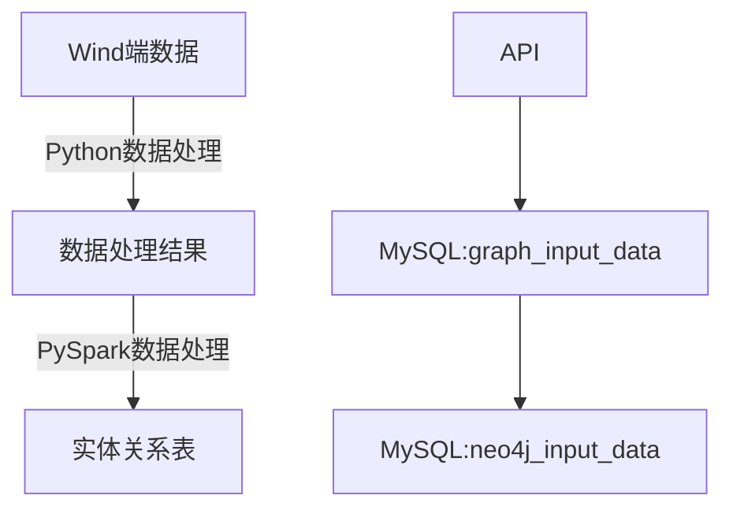

# 一、本体

## 1.包含的信息内容

1.1.上市公司基本信息

1.2.董监高法信息（自然人消歧）

1.3.股东信息：前五大股东，股权变动频繁，公司发债、股权质押短期内到期的情况、短期有没有资金流问题这些等等

1.4.供应商客户信息

1.5.行业信息（上游行业、下游行业）

1.6.财务信息

1.7.主营产品信息

## 2.本体

## 3.ETL规则

## 4.数据流

